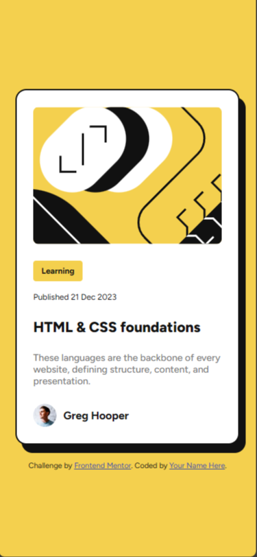
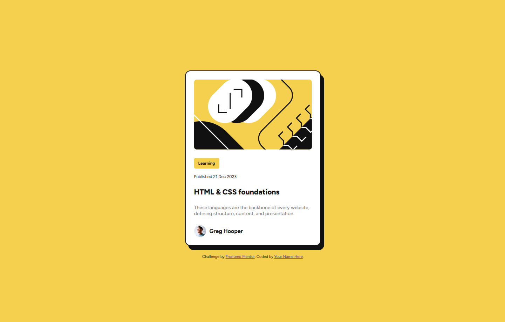
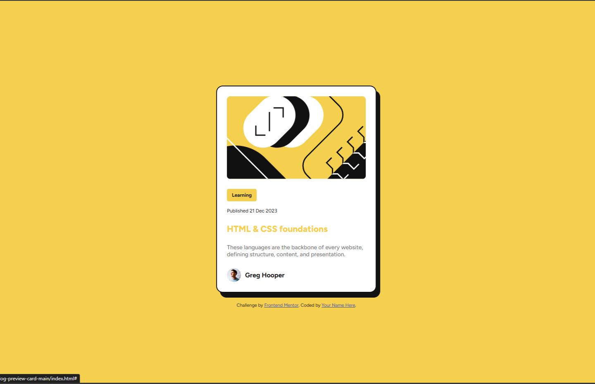

# Frontend Mentor - Blog preview card solution

This is a solution to the [Blog preview card challenge on Frontend Mentor](https://www.frontendmentor.io/challenges/blog-preview-card-ckPaj01IcS). Frontend Mentor challenges help you improve your coding skills by building realistic projects. 

## Table of contents

- [Overview](#overview)
  - [The challenge](#the-challenge)
  - [Screenshot](#screenshot)
  - [Links](#links)
- [My process](#my-process)
  - [Built with](#built-with)
  - [What I learned](#what-i-learned)
- [Author](#author)
- [Acknowledgments](#acknowledgments)

## Overview

### The challenge

Users should be able to:

- See hover and focus states for all interactive elements on the page

### Screenshot

Screenshot 375px

Screenshot 1440px

Screenshot active 1440px

### Links

- Solution URL: [Add solution URL here](https://github.com/santiagopagura/blog-preview-card-main.git)
- Live Site URL: [Add live site URL here](https://santiagopagura.github.io/blog-preview-card-main/)

## My process

### Built with

- Semantic HTML5 markup
- CSS custom properties
- Flexbox

### What I learned

This time I tried to modify one element by activating another, which I could not do but it led me to review the theory of adjacent siblings. Which I find very interesting. 

## Author

- LinkedIn - (www.linkedin.com/in/spagura)
- Frontend Mentor - [@santiagopagura](https://www.frontendmentor.io/profile/yourusername)

## Acknowledgments

I thank Frontend Mentor for providing me with practical challenges to improve my frontend development skills.

And also in this opportunity to my sister who is a QA expert.
